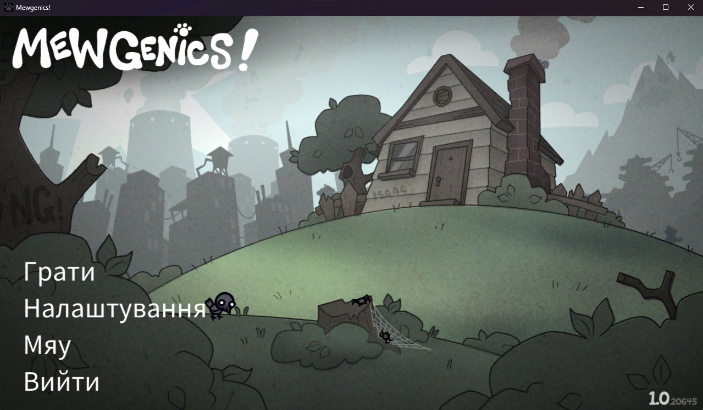

# Mewgenics — Ukrainian Translation

Unofficial Ukrainian localization for the Steam game [Mewgenics](https://store.steampowered.com/app/1223680/Mewgenics/). Uses LLM-powered translation to convert English game text into Ukrainian and patches it directly into the game.

[Українська версія](README.md)



## For Players

Download the latest build for your platform from [Releases](https://github.com/tarik02/mewgenics-uk/releases), run the executable, and it will automatically:

1. Find your Mewgenics installation via Steam
2. Back up the original game data (`resources.gpak` -> `resources.gpak.bak`)
3. Patch Ukrainian translations into the game

Re-run the patcher any time after a game update to re-apply translations.

## Caveats & Future Improvements

- The patch does not add a new language — it replaces an existing one (in this case, Spanish with Ukrainian). This means if you want to revert to the original English, you need to restore the backup `resources.gpak.bak`, or verify game files through Steam.
- The translation may contain errors or inaccuracies, as it was generated automatically with minimal manual intervention.
- It would be nice to automate the translation update process after a game patch (steamcmd + scheduled GitHub Actions).

## Additional Changes

### data/uk/translated/swfs/unicodefont.swf

The file was edited using [JPEXS Free Flash Decompiler](https://github.com/jindrapetrik/jpexs-decompiler).
The only change — characters "іїєІЇЄ" from the "Noto Sans Regular" font were added to the "Noto Sans CJK TC Regular" font.

## For Developers

### Requirements

- [uv](https://docs.astral.sh/uv/) package manager

### Setup

```bash
uv sync
```

### Workflow

The translation pipeline has three steps:

**1. Extract** English text from the game archive:

```bash
uv run python extract_text.py
```

Auto-detects your Steam installation. Override with `--gpak <path>` if needed. Outputs CSV files to `data/extracted/`.

**2. Translate** using an OpenAI-compatible API:

```bash
uv run python translate.py
```

Requires `OPENAI_API_KEY` (and optionally `OPENAI_BASE_URL`) environment variables.

Options:

| Flag | Description | Default |
|------|-------------|---------|
| `--lang <code>` | Target language (`uk`, `de`, `fr`, `es`, `it`, `pt`, `pl`, `ja`, `ko`, `zh`) | `uk` |
| `--model <name>` | LLM model to use | `gpt-5-mini` |
| `--workers <n>` | Parallel API requests | `8` |
| `--file <name>` | Translate a single CSV file | all files |
| `--resume` | Continue after interruption | off |
| `--fresh` | Retranslate everything from scratch | off |

Translation features:
- Batch processing (20 texts per request) with automatic fallback to one-by-one
- Change detection — only retranslates new or modified English entries
- Resume support via progress file (`data/<lang>/progress.json`)
- Optional glossary (`data/<lang>/glossary.csv`) for consistent terminology
- Optional custom prompt (`data/<lang>/prompt.txt`) for language-specific rules
- Game markup preservation (`[img:...]`, `[b]`, `[color...]`, etc.)

**3. Patch** translations back into the game:

```bash
uv run python patch_gpak.py
```

Creates a backup and replaces text files in the game archive with translated versions.

### Building Executables

```bash
uv run --group build python build_exe.py
```

Produces a single-file executable in `dist/` that bundles the translated data and patcher.

## Sponsorship

If you like this project, please consider supporting the author:

- [Sponsor on GitHub](https://github.com/sponsors/tarik02)
- [Buy Me A Coffee](https://buymeacoffee.com/tarik02)

## License

[MIT](LICENSE)
